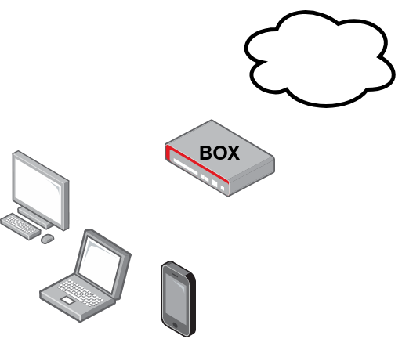
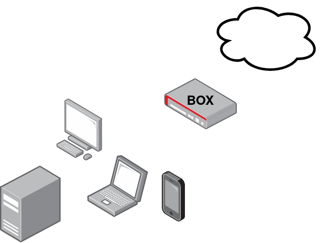
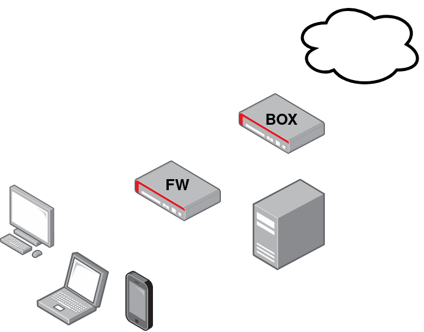

# Physical infra

## Where to place my server?

Typically a basic home network look like this.

You will probably place your server just behind you box/modem. But don't do that! Because it's not secure. If your server got hacked, then all your devices connected to you modem could be hacked.

Also, several modems have a "DMZ" functionality. You mustn't use it because it's not a real DMZ. It's just a rule to say "open all on this device".

Instead, we recommend placing a firewall just behind your modem in order to create a real DMZ. And open just the ports you need to your server from your modem.

